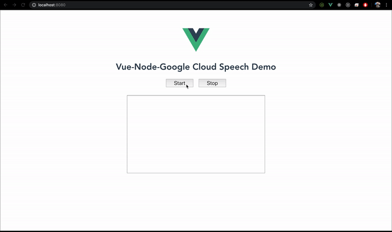

<h1 align="center">
  <div>
    
  </div>
</h1>

# Brief
This is a simple demo how to use Google Cloud Speech with VueJS and NodeJS

# Usage
First install dependencies by running:
```
npm install
```

### Start client
Run `npm run serve` to start VueJS client

### Start backend
Before start backend you have to export an environment that links to your Google Service Account Key

Eg:
```
export GOOGLE_APPLICATION_CREDENTIALS="absolute_path_to_service_acount_key_file"
```
Then in the same terminal, run the following command to start backend:
```
npm run dev
```

Now you're ready to go